# Phase 3 Architecture — V3 Multimodal Fake-News Detector

## Overview

Phase 3 is the late-stage diagnostic and integration phase of the V3 pipeline. In this phase
we (i) diagnosed and characterized the Class-4 "Double-Fake" image-side shortcut (BLIP-2
caption style + GenImage/Midjourney fingerprint), (ii) confirmed the structural ~0.42
Real<->OOC ceiling inherited from NewsCLIPpings, (iii) swapped in Qwen2-7B-Instruct as the
textual-forensic encoder (rev 11) drop-in-compatible with `V3FusionModule`, and (iv) wired
the trained 5-class pipeline into the FastAPI demo (`app/server.py`) for live inference.

## Data Flow (Mermaid)

```mermaid
flowchart LR
    %% =========================================================
    %% Inputs
    %% =========================================================
    TXT["Text<br/>(article)"]:::input
    IMG["Image<br/>(uploaded JPG/PNG)"]:::input

    %% =========================================================
    %% Preprocessing branches
    %% =========================================================
    subgraph PRE["Preprocessing"]
        direction TB
        BERT_TOK["BERT tokens<br/>(ids, mask)"]:::pre
        CLIP_TOK["CLIP tokens<br/>(ids, mask)"]:::pre
        CLIP_PIX["CLIP pixels<br/>[3,224,224]"]:::pre
        IMG_224["Image<br/>[3,224,224]"]:::pre
        DCT["JPEG q=85<br/>+ BGR->YCbCr (Y)<br/>+ 8x8 patch log|DCT|<br/>+ per-image min-max<br/>= [1,224,224]"]:::pre
        QTOK["Qwen tokens<br/>(left-pad, max=512)"]:::pre
    end

    TXT --> BERT_TOK
    TXT --> CLIP_TOK
    TXT --> QTOK
    IMG --> IMG_224
    IMG --> CLIP_PIX
    IMG --> DCT

    %% =========================================================
    %% Encoder lanes
    %% =========================================================
    subgraph ENC["Encoders (all frozen at Stage 2)"]
        direction TB

        subgraph LANE1["FND-CLIP (frozen — V1 best.pt)"]
            FNDCLIP["forward_semantic()<br/>visual + text + CLIP pair<br/>+ modality attn pool"]:::frozen
        end

        subgraph LANE2["UnivFD on patch-DCT (frozen — Stage-1 best.pt)"]
            UNIVFD["ResNet50<br/>conv1: 1-ch (Kaiming)<br/>fc -> Flatten + Dropout(0.3) + Linear(2048->768)"]:::frozen
        end

        subgraph LANE3["Qwen2-7B-Instruct (frozen)"]
            QWEN["28 transformer blocks<br/>hidden_size=3584<br/>output_hidden_states=True<br/>hidden_states[-1] + masked-mean pool"]:::frozen
        end
    end

    IMG_224  --> FNDCLIP
    BERT_TOK --> FNDCLIP
    CLIP_TOK --> FNDCLIP
    CLIP_PIX --> FNDCLIP
    DCT      --> UNIVFD
    QTOK     --> QWEN

    %% =========================================================
    %% Raw encoder outputs
    %% =========================================================
    VSEM["v_semantic<br/>[B, 512]"]:::tensor
    VIMG["v_imgfor<br/>[B, 768]"]:::tensor
    VTXT["v_textfor<br/>[B, 3584]"]:::tensor

    FNDCLIP --> VSEM
    UNIVFD  --> VIMG
    QWEN    --> VTXT

    %% =========================================================
    %% Front-end trainable projections
    %% =========================================================
    subgraph PROJ["Front-end projections (trainable, Stage 2)"]
        direction TB
        SEMPROJ["sem_proj<br/>Linear(512 -> 768) + GELU"]:::trainable
        TXTPROJ["text_proj<br/>Linear(3584 -> 768) + GELU"]:::trainable
    end

    VSEM --> SEMPROJ
    VTXT --> TXTPROJ

    VSEM768["v_semantic_768<br/>[B, 768]"]:::tensor
    VTXT768["v_textfor_768<br/>[B, 768]"]:::tensor
    SEMPROJ --> VSEM768
    TXTPROJ --> VTXT768

    %% =========================================================
    %% V3FusionModule
    %% =========================================================
    subgraph FUSION["V3FusionModule (trainable, Stage 2)"]
        direction TB

        LN1["LayerNorm(768)"]:::trainable
        LN2["LayerNorm(768)"]:::trainable
        LN3["LayerNorm(768)"]:::trainable

        subgraph PAIRS["3 x PairwiseCrossAttention<br/>(8 heads, dropout 0.1, bidirectional SUM + LayerNorm)"]
            direction TB
            P1["Pair 1: semantic &lt;-&gt; imgfor<br/>-> r1 [B, 768]"]:::trainable
            P2["Pair 2: semantic &lt;-&gt; textfor<br/>-> r2 [B, 768]"]:::trainable
            P3["Pair 3: imgfor   &lt;-&gt; textfor<br/>-> r3 [B, 768]"]:::trainable
        end

        STACK["stack[r1,r2,r3]<br/>[B, 3, 768] -> permute -> [B, 768, 3]"]:::tensor
        CONV1["Conv1d(768->768, k=3, p=1) + GELU"]:::trainable
        CONV2["Conv1d(768->1024, k=1) + GELU"]:::trainable
        POOL["AdaptiveAvgPool1d(1)<br/>fused = [B, 1024]"]:::tensor

        subgraph HEAD["V3Classifier (MLP head)"]
            direction TB
            H1["Linear(1024->512) + BN + GELU + Dropout(0.5)"]:::trainable
            H2["Linear(512->256) + GELU"]:::trainable
            H3["Linear(256->5)"]:::trainable
        end

        LN1 --> P1
        LN1 --> P2
        LN2 --> P1
        LN2 --> P3
        LN3 --> P2
        LN3 --> P3

        P1 --> STACK
        P2 --> STACK
        P3 --> STACK
        STACK --> CONV1 --> CONV2 --> POOL
        POOL --> H1 --> H2 --> H3
    end

    VSEM768 --> LN1
    VIMG    --> LN2
    VTXT768 --> LN3

    %% =========================================================
    %% Outputs
    %% =========================================================
    LOGITS["main_logits<br/>[B, 5]"]:::output
    SOFTMAX["softmax<br/>p(Real, OOC, Manip, AI-Text, Double-Fake)"]:::output
    H3 --> LOGITS --> SOFTMAX

    %% =========================================================
    %% Aux head (training only, gradient-isolated)
    %% =========================================================
    AUX["Aux head (training only)<br/>Linear(768->2) on v_imgfor.detach()<br/>aux_logits [B, 2]<br/>BCE on binary image-AI/tampered"]:::aux
    VIMG -. "v_imgfor.detach()" .-> AUX

    %% =========================================================
    %% Styling
    %% =========================================================
    classDef input      fill:#fffbe6,stroke:#b58900,stroke-width:2px,color:#000;
    classDef pre        fill:#f5f5f5,stroke:#888,stroke-width:1px,color:#000;
    classDef frozen     fill:#e8f0fe,stroke:#1a73e8,stroke-width:2px,color:#000;
    classDef trainable  fill:#e6f4ea,stroke:#0b8043,stroke-width:2px,color:#000;
    classDef tensor     fill:#ffffff,stroke:#333,stroke-dasharray:3 3,color:#000;
    classDef output     fill:#fde7e9,stroke:#c5221f,stroke-width:2px,color:#000;
    classDef aux        fill:#f3e8fd,stroke:#8430ce,stroke-width:1px,stroke-dasharray:4 3,color:#000;
```

Legend: blue = frozen encoder, green = trainable Stage-2 module, dashed white = intermediate
tensor, red = output, purple-dashed = training-only auxiliary path.

## Class definitions (5-class)

| ID | Label             | Description                                                                                                                    |
|----|-------------------|--------------------------------------------------------------------------------------------------------------------------------|
| 0  | Real              | Authentic news: original image paired with its true caption.                                                                  |
| 1  | Out-of-Context    | Authentic image, authentic caption, but the two were never paired in reality (mismatched event/entity).                       |
| 2  | Manipulated       | Image has been edited, spliced, or otherwise tampered (digital forgery); text is human-written.                                |
| 3  | AI-Text           | Image is authentic; the caption/article text was generated or rewritten by an LLM.                                            |
| 4  | Fully-Fabricated  | "Double-Fake" — image is AI-generated (or tampered) AND the accompanying text is LLM-generated/rewritten.                     |

## Numbers (rev 12 canonical)

| Metric                                                              | Value     |
|---------------------------------------------------------------------|-----------|
| Test F1-macro (RoBERTa V3.1)                                        | **0.5391** |
| Qwen rev 11 F1-macro                                                | 0.5377    |
| Class 4 F1 (Fully-Fabricated / Double-Fake)                         | **0.995** — persists even after caption-rewrite c4fix (shortcut is on the **image** side: GenImage Midjourney fingerprint) |
| Real <-> OOC ceiling (structural to NewsCLIPpings, not a model bug) | ~0.42     |
| MMFakeBench transfer F1-macro (out-of-distribution generalization)  | 0.3832    |
