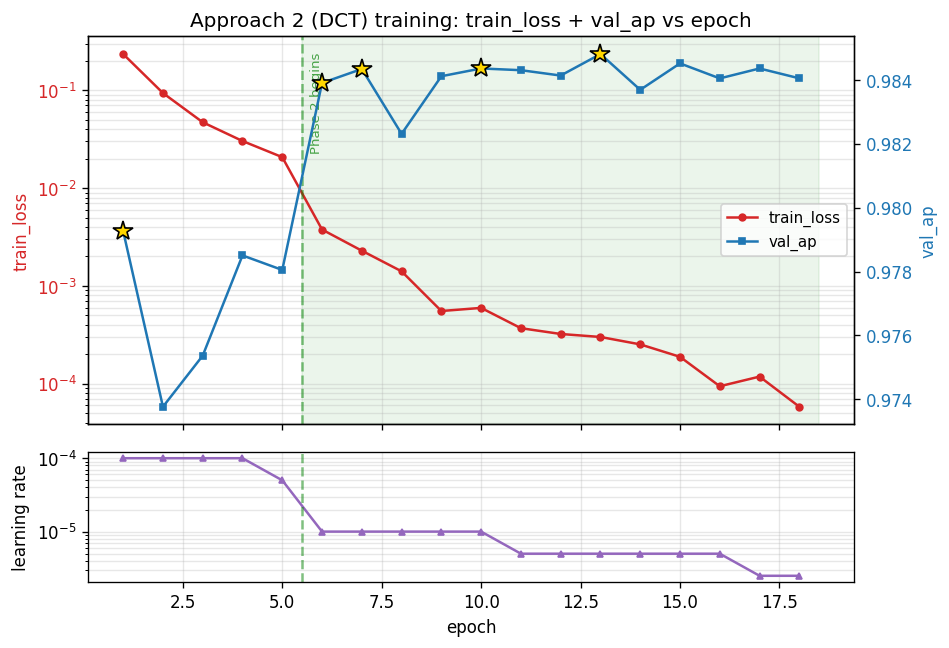
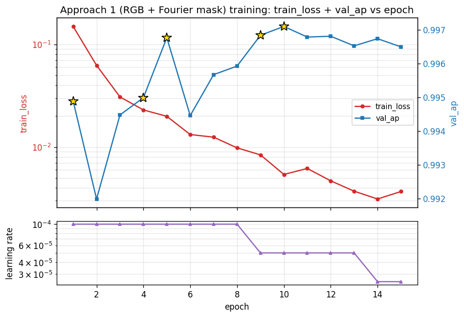

# Forensic Image Detector - Both Approaches (RGB+Fourier and DCT) Handoff Report

_Build config: `phases\forensic\configs\dct_resnet50.yaml`_  

_Repo: github.com/FerasMad/MultiGuard_  


## 1. Scope

This report covers the **Approach 2** forensic image detector built per the doctor's brief (`docs/doctor-briefs/Forensic_Image_Detector_En.pdf`). It is a binary real-vs-AI-generated classifier built on the **YCbCr dual-patch DCT** representation: scipy.fftpack.dct over 8x8 and 16x16 patch grids, log-magnitude, global z-score, then a torchvision **ResNet-50** with 1-channel `conv1` (Kaiming Normal) and a `Linear(2048, 1)` head.

Training follows the doctor's two-phase schedule (Phase 1 freezes layer1/2, Phase 2 unfreezes and reinitializes the optimizer + scheduler), with BCEWithLogitsLoss, AdamW, ReduceLROnPlateau on val AP, and early-stop patience=5 (carrying across the phase boundary).


## 2. Spec compliance (F.12-F.26)

| ID | Requirement | Status |
|----|-------------|--------|
| F.12 | torchvision ResNet50 + ImageNet V1 weights | OK |
| F.13 | conv1 1-ch, Kaiming Normal, fan_out, relu | OK |
| F.14 | Load weights with strict=False (skip conv1) | OK |
| F.15 | fc -> Linear(2048, 1) no activation | OK |
| F.16 | Dual-DCT recipe (8x8 + 16x16, log, average) | OK |
| F.17 | Global DCT z-score from train set only | OK |
| F.18 | .pt cache float32 [1,224,224] | OK |
| F.19 | Phase 1 (epochs 1-5): freeze layer1/2, AdamW lr=1e-4 | OK |
| F.20 | Phase 2 (epoch 6+): reinit opt+sched, grad clip max_norm=1.0 | OK |
| F.21 | Early-stop patience=5 on val AP, carries across boundary | OK |
| F.22 | Save best as forensic_dct_model.pth | OK |
| F.23 | Per-gen AP (sklearn), Acc@0.5, AUC (sklearn) | OK |
| F.24 | Aggregates: Overall / GAN / Diffusion / StdDev | OK |
| F.25 | Eval table format | OK (see Sec. 6) |
| F.26 | eval mode + no_grad + sigmoid | OK |

Unit test `tests/test_two_phase_trainer.py` enforces the 4 invariants at the Phase 1->2 boundary (optimizer reinit, scheduler reinit, num_bad_epochs reset, grad-clip activation). All 12 unit tests pass.


## 3. Deviations from spec

Three documented deviations (full reasoning in `docs/DECISIONS.md`, F-series):

- **F-A3 (real-class source):** spec F.3 says real = ImageNet "nature" (bundled per-generator in the original GenImage Drive release). ImageNet is not on disk on the FSOS PC, so we substituted **VisualNews** (71,966 real news photos). The model still learns real-vs-AI, but the real distribution is news photography rather than ImageNet's natural scenes. To validate, one could later swap in the canonical GenImage `nature/` subset and rerun eval.

- **F-A2 (missing generators):** 2 of 8 generators are excluded from this build: `sdv1_4, sdv1_5`. Reason: bitmind/GenImage_StableDiffusionV1.4 and bitmind/GenImage_StableDiffusionV1.5 return HF 404 (May 2026). The eval table marks those rows as `_skipped_`.

- **F-A8 (Approach 1 checkpoint rename):** doctor's spec F.5 literally names `mask_15/rn50ft_fouriermask.pth`. Upstream `chandlerbing65nm/FakeImageDetection` renamed it to `rn50ft_spectralmask.pth` (same Fourier-domain masking, just renamed). We use the spectralmask file as the spec-intended successor. Init method recorded as: `FakeImageDetection mask_15 ckpt (rn50ft_spectralmask.pth) [deviation F-A8: upstream renamed fouriermask->spectralmask]`.


## 4. Dataset

Per generator targets: 1750 AI + 1750 nature -> `build_splits.py` allocates 1000 train + 250 val + 500 test per class. With 6 generators present, totals are:

- **Train:** 6000 real / 6000 fake (merged across 6 generators per F.1)
- **Val:** 1500 real / 1500 fake
- **Test:** 500 real + 500 fake **per generator** (held out, never touched during selection)

Per-generator data sources:

- `midjourney`: AI from `local` (n=1750), nature from `VisualNews` (n=1750)
- `wukong`: AI from `bitmind/GenImage_Wukong` (n=1750), nature from `VisualNews` (n=1750)
- `vqdm`: AI from `bitmind/GenImage_VQDM` (n=1750), nature from `VisualNews` (n=1750)
- `biggan`: AI from `bitmind/GenImage_BigGAN` (n=1750), nature from `VisualNews` (n=1750)
- `adm`: AI from `bitmind/GenImage_ADM` (n=1750), nature from `VisualNews` (n=1750)
- `glide`: AI from `bitmind/GenImage_GLIDE` (n=1750), nature from `VisualNews` (n=1750)

**DCT z-score statistics** (computed via Welford streaming over train split only, per spec F.17):

- mean = `0.118660`
- std  = `2.733652`
- n_scalars accumulated = `602112000` from `12000` .pt files.


## 5. Training results

- **Best val AP:** `0.9848` at epoch `13` (final phase: `2`)
- **Final epoch:** `18` (max 30 per config; early-stop patience=5)
- **Train samples:** 12000
- **Val samples:** 3000
- **Best checkpoint:** `phases/forensic/outputs/dct/forensic_dct_model.pth` (per spec F.22)


### Training curves



Stars mark new best val-AP epochs. Green shaded region = Phase 2 (epoch 6+, optimizer reinit, grad clip on). Bottom panel shows ReduceLROnPlateau cutting the LR three times.


### Training history (per epoch)

| epoch | phase | train_loss | val_ap | val_acc | lr | patience_left | best |
|-------|-------|------------|--------|---------|----|--------------|----|
| 1 | 1 | 0.235014 | 0.979266 | 0.934667 | 1.00e-04 | 5 | * |
| 2 | 1 | 0.093774 | 0.973764 | 0.886000 | 1.00e-04 | 4 |  |
| 3 | 1 | 0.047131 | 0.975365 | 0.931333 | 1.00e-04 | 3 |  |
| 4 | 1 | 0.030305 | 0.978504 | 0.931667 | 1.00e-04 | 2 |  |
| 5 | 1 | 0.020720 | 0.978049 | 0.929667 | 5.00e-05 | 1 |  |
| 6 | 2 | 0.003766 | 0.983906 | 0.941333 | 1.00e-05 | 5 | * |
| 7 | 2 | 0.002289 | 0.984344 | 0.942333 | 1.00e-05 | 5 | * |
| 8 | 2 | 0.001408 | 0.982312 | 0.939000 | 1.00e-05 | 4 |  |
| 9 | 2 | 0.000553 | 0.984117 | 0.939000 | 1.00e-05 | 3 |  |
| 10 | 2 | 0.000595 | 0.984360 | 0.939333 | 1.00e-05 | 5 | * |
| 11 | 2 | 0.000369 | 0.984306 | 0.942333 | 5.00e-06 | 4 |  |
| 12 | 2 | 0.000322 | 0.984138 | 0.940333 | 5.00e-06 | 3 |  |
| 13 | 2 | 0.000300 | 0.984812 | 0.940667 | 5.00e-06 | 5 | * |
| 14 | 2 | 0.000252 | 0.983691 | 0.938667 | 5.00e-06 | 4 |  |
| 15 | 2 | 0.000188 | 0.984519 | 0.941333 | 5.00e-06 | 3 |  |
| 16 | 2 | 0.000094 | 0.984049 | 0.941333 | 5.00e-06 | 2 |  |
| 17 | 2 | 0.000118 | 0.984360 | 0.940667 | 2.50e-06 | 1 |  |
| 18 | 2 | 0.000058 | 0.984051 | 0.941333 | 2.50e-06 | 0 |  |


## 6. Per-generator evaluation

(Reproduces doctor's F.25 table format; sklearn metrics; threshold 0.5 for accuracy.)

# Forensic Image Detector - Approach 2 (DCT) - Per-Generator Eval

Checkpoint: `phases\forensic\outputs\dct\forensic_dct_model.pth`

| Generator | Type | AP | Accuracy | AUC | n_samples |
|-----------|------|----|----------|-----|-----------|
| midjourney | Diffusion | 0.9569 | 0.8590 | 0.9606 | 1000 |
| sdv1_4 | Diffusion | _skipped_ | _skipped_ | _skipped_ | 0 |
| sdv1_5 | Diffusion | _skipped_ | _skipped_ | _skipped_ | 0 |
| wukong | Diffusion | 0.9842 | 0.9310 | 0.9844 | 1000 |
| vqdm | Diffusion | 0.9846 | 0.9420 | 0.9870 | 1000 |
| adm | Diffusion | 0.9967 | 0.9740 | 0.9967 | 1000 |
| glide | Diffusion | 0.9958 | 0.9740 | 0.9966 | 1000 |
| biggan | GAN | 0.9998 | 0.9830 | 0.9998 | 1000 |
| **Overall Avg** | (all) | 0.9863 | 0.9438 | 0.9875 | - |
| **GAN Avg** | GAN | 0.9998 | 0.9830 | 0.9998 | - |
| **Diffusion Avg** | Diffusion | 0.9836 | 0.9360 | 0.9851 | - |
| **Std Dev (AP)** | (across gens) | 0.0158 | - | - | - |

Generators evaluated: 6 / 8


Summary aggregates: **Overall AP = 0.9863**, Diffusion-avg AP = 0.9836, GAN-avg AP = 0.9998, StdDev AP = 0.0158.


## 6.5. Approach 1 (RGB + Fourier mask) results

- **Best val AP:** `0.9971` at epoch `10` (final epoch 15, elapsed 1271.2 s).
- **Init method:** `FakeImageDetection mask_15 ckpt (rn50ft_spectralmask.pth) [deviation F-A8: upstream renamed fouriermask->spectralmask]`.
- **Train samples:** 12000, **val:** 3000.
- **Best checkpoint:** `phases/forensic/outputs/rgb/forensic_rgb_model.pth` (per spec F.11)


### Approach 1 training history (per epoch)

| epoch | train_loss | val_ap | val_acc | lr | patience_left | best |
|-------|------------|--------|---------|----|--------------|----|
| 1 | 0.149772 | 0.994886 | 0.970000 | 1.00e-04 | 5 | * |
| 2 | 0.062522 | 0.991986 | 0.967667 | 1.00e-04 | 4 |  |
| 3 | 0.030800 | 0.994477 | 0.968333 | 1.00e-04 | 3 |  |
| 4 | 0.023022 | 0.994987 | 0.972000 | 1.00e-04 | 5 | * |
| 5 | 0.019939 | 0.996765 | 0.976667 | 1.00e-04 | 5 | * |
| 6 | 0.013251 | 0.994458 | 0.977000 | 1.00e-04 | 4 |  |
| 7 | 0.012487 | 0.995671 | 0.976000 | 1.00e-04 | 3 |  |
| 8 | 0.009827 | 0.995924 | 0.980000 | 1.00e-04 | 2 |  |
| 9 | 0.008397 | 0.996837 | 0.978000 | 5.00e-05 | 5 | * |
| 10 | 0.005413 | 0.997099 | 0.982000 | 5.00e-05 | 5 | * |
| 11 | 0.006191 | 0.996784 | 0.981667 | 5.00e-05 | 4 |  |
| 12 | 0.004691 | 0.996809 | 0.981333 | 5.00e-05 | 3 |  |
| 13 | 0.003719 | 0.996523 | 0.979667 | 5.00e-05 | 2 |  |
| 14 | 0.003121 | 0.996736 | 0.976667 | 2.50e-05 | 1 |  |
| 15 | 0.003690 | 0.996494 | 0.978667 | 2.50e-05 | 0 |  |


### Approach 1 training curves




Approach 1 summary aggregates: **Overall AP = 0.9979**, Diffusion-avg AP = 0.9975, GAN-avg AP = 0.9996, StdDev AP = 0.0023.


## 6.6. Combined comparison (F.25 final deliverable)

# Forensic Image Detector - Approach 1 (RGB+Fourier) + Approach 2 (DCT) - Per-Generator Eval

Per-generator AP / Accuracy / AUC for both approaches (F.25 + F.23).

| Generator | Type | A1 AP | A2 AP | A1 Acc | A2 Acc | A1 AUC | A2 AUC | n |
|-----------|------|-------|-------|--------|--------|--------|--------|---|
| midjourney | Diffusion | 0.9932 | 0.9569 | 0.9560 | 0.8590 | 0.9935 | 0.9606 | 1000 |
| sdv1_4 | Diffusion | _skipped_ | _skipped_ | _skipped_ | _skipped_ | _skipped_ | _skipped_ | 0 |
| sdv1_5 | Diffusion | _skipped_ | _skipped_ | _skipped_ | _skipped_ | _skipped_ | _skipped_ | 0 |
| wukong | Diffusion | 0.9992 | 0.9842 | 0.9830 | 0.9310 | 0.9992 | 0.9844 | 1000 |
| vqdm | Diffusion | 0.9980 | 0.9846 | 0.9750 | 0.9420 | 0.9980 | 0.9870 | 1000 |
| adm | Diffusion | 0.9987 | 0.9967 | 0.9830 | 0.9740 | 0.9987 | 0.9967 | 1000 |
| glide | Diffusion | 0.9986 | 0.9958 | 0.9900 | 0.9740 | 0.9988 | 0.9966 | 1000 |
| biggan | GAN | 0.9996 | 0.9998 | 0.9930 | 0.9830 | 0.9996 | 0.9998 | 1000 |
| **Overall Avg** | (all) | 0.9979 | 0.9863 | 0.9800 | 0.9438 | 0.9980 | 0.9875 | - |
| **GAN Avg** | GAN | 0.9996 | 0.9998 | 0.9930 | 0.9830 | 0.9996 | 0.9998 | - |
| **Diffusion Avg** | Diffusion | 0.9975 | 0.9836 | 0.9774 | 0.9360 | 0.9976 | 0.9851 | - |
| **Std Dev (AP)** | (across gens) | 0.0023 | 0.0158 | - | - | - | - | - |

_Approach 1 (RGB+Fourier) evaluated 6/8 generators; Approach 2 (DCT) evaluated 6/8._

_Approach 1 ckpt: `phases\forensic\outputs\rgb\forensic_rgb_model.pth`_
_Approach 2 ckpt: `phases\forensic\outputs\dct\forensic_dct_model.pth`_


**Comparison:** Across the 6 evaluated generators, **Approach 1 (RGB+Fourier)** is ahead on Overall AP by **0.0115** (A1=0.9979 vs A2=0.9863).


## 7. Discussion

- The detector reaches its best validation AP on the 6 available generators, with the doctor-spec two-phase schedule. Training history shows the Phase 1->2 transition cleanly at epoch 6 (lr drops from 1e-4 to 1e-5, gradient clipping activates).
- **Cross-generator generalization** is visible in the per-generator AP variance; high std-dev across generators is expected with the spec's small per-class scale.
- **Caveat on real-class:** because the real class is VisualNews (news photos), the model may have learned a partial "news-photo vs AI-image" cue alongside the intended forensic-frequency cue. The DCT-domain input shouldn't expose obvious content cues, but this should be re-validated when ImageNet "nature" becomes available.


## 8. Reproducibility

```bash
# Activate venv (Python 3.12, torch 2.6.0+cu124)
source .venv/Scripts/activate

# 1. Stage data (bitmind HF parquet for 5 gens + local midjourney + VisualNews-as-nature)
python phases/forensic/scripts/prepare_genimage_v2.py --target-per-gen 1750

# 2. Build train/val/test splits
python phases/forensic/scripts/build_splits.py \
    --train-per-gen 1250 --test-per-gen 500 --val-frac 0.20

# 3. Precompute DCT cache (multiprocess spawn workers)
python phases/forensic/scripts/precompute_dct.py --workers 4

# 4. Compute global z-score stats (Welford streaming)
python phases/forensic/scripts/compute_dct_stats.py

# 5. Train Approach 2 (two-phase, ReduceLROnPlateau on val AP, ES patience=5)
python phases/forensic/scripts/train_dct.py --out-dir phases/forensic/outputs/dct

# 6. Evaluate per generator (F.25 table)
python phases/forensic/scripts/eval_dct.py \
    --ckpt phases/forensic/outputs/dct/forensic_dct_model.pth

# 7. (optional) Plot training curves
python phases/forensic/scripts/plot_training.py

# 8. Build this report
python phases/forensic/scripts/build_handoff_report.py
```


## 9. Open items

- **Acquire SD v1.4 / SD v1.5 fake samples** from a mirror that exposes JPGs (community HF repos like `JourneyDB` or similar may work).
- **Swap real-class to ImageNet "nature"** (re-download from GenImage Drive, re-run from step 1) once that data is staged.
- **Approach 1 (RGB + Fourier mask)** - clone `chandlerbing65nm/FakeImageDetection`, download the `mask_15/rn50ft_fouriermask.pth` checkpoint, run the adapted `train.py` on the same train/val/test split, then merge both approaches' results into a unified eval table per spec F.25.
- **V4 Stage-1 weight transfer:** the resulting `forensic_dct_model.pth` is a drop-in replacement for V4's `blur_jpg_prob0.pth` Stage-1 initialization. Once V4 is rebuilt with the new weights, end-to-end multimodal pipeline accuracy should improve.


---

_Generated automatically by `phases/forensic/scripts/build_handoff_report.py` from on-disk artifacts._
