# MultiGuard Pluggable Pipeline — Technical Design Review

> Scope: the dependency-injection pipeline under `phases/v4/src/v4/pipeline/`
> (5 single-class files). This is a comprehensive review: Architecture, a
> per-class reference, Data Flow, Control Flow, Component Integration, an
> Extensibility Guide, Evaluation Methodology, Verification, and Analysis —
> each with diagrams.

---

## 0. Summary

The pipeline was refactored from a "build-it-inside" design into a **pluggable,
dependency-injection** design. Every model is **passed in from the outside**; no
wrapper builds a model. Each wrapper **auto-infers its `out_dim`** (no hardcoded
dimensions). The four branch files are **fully decoupled** (they never import
each other); only `main_pipeline.py` wires them together.

| Goal | How it is met |
|------|---------------|
| Pluggable / any model | Models injected via `__init__`; wrappers are model-agnostic |
| No hardcoded dimensions | `out_dim` inferred from a probe forward (or a model attribute) |
| Strict decoupling | Branch files import only `torch` + stdlib; never each other |
| Single orchestrator | Only `MainPipeline` imports the four wrappers |
| Swap a model = edit one file | Build a different model, pass it to the matching wrapper |

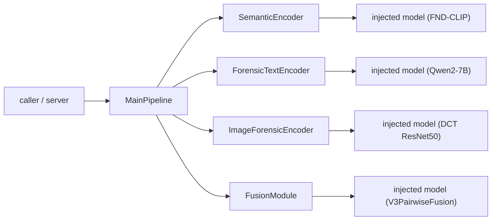

---

## 1. Architecture (المعمارية)

### 1.1 Principles

- **Dependency injection** — a wrapper receives a ready `nn.Module`; it raises
  `TypeError` for anything else. It never constructs a backbone.
- **Auto `out_dim`** — resolved once at construction time (probe forward = source
  of truth; model attribute = fallback). No dimension literal appears in a wrapper.
- **Strict decoupling** — enforced by imports: branch files import only `torch`
  and stdlib; only `main_pipeline.py` (+ `__init__.py` for re-export) import them.
- **Plain `nn.Module`** — the pipeline composes like any PyTorch module:
  `.to(device)`, `.eval()`, `state_dict()`, autograd all work unchanged.

### 1.2 Layered architecture

Two clean layers: the **wrapper layer** (this package, model-agnostic) and the
**model layer** (the real backbones, built elsewhere and injected).

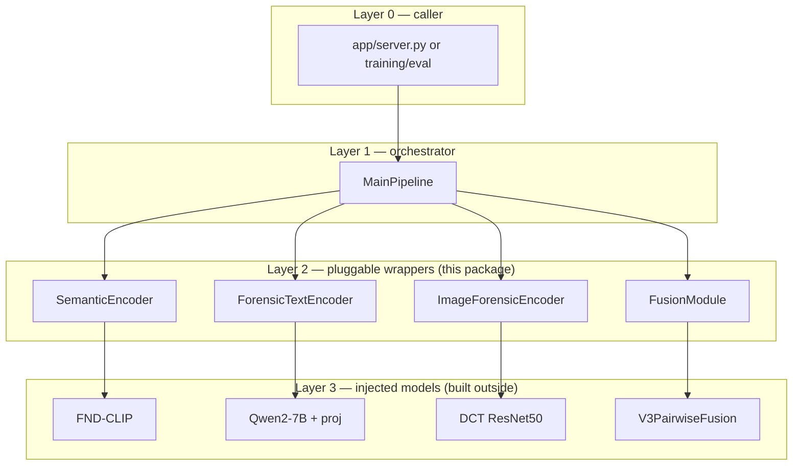

### 1.3 Decoupling & import graph

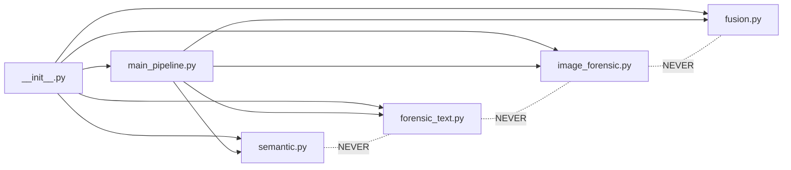

Solid = allowed import; dotted "NEVER" = forbidden (verified by grep — no branch
file imports another).

### 1.4 Class diagram

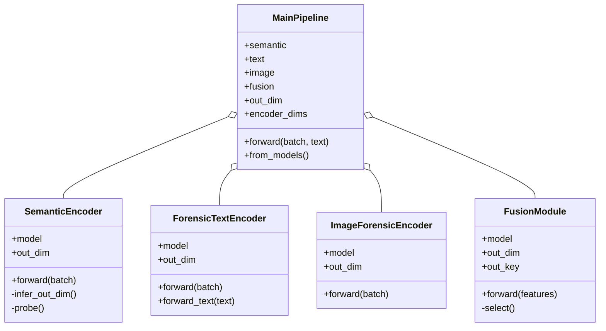

---

## 2. Class Reference (per-class detail)

Every wrapper follows the same shape: inject a model, expose `out_dim`, delegate
`forward`. Below, each class lists its constructor, behaviour, and a mini flow.

### 2.1 `SemanticEncoder` (`semantic.py`)

- **Constructor:** `SemanticEncoder(model, example_input=None)`
- **forward:** `forward(batch) -> Tensor[B, out_dim]` — delegates to `model(batch)`.
- **out_dim:** probe `model(example_input)` then read `shape[-1]`; else read one of
  `("out_dim","output_dim","embed_dim","hidden_size")`.
- **Wraps (typical):** FND-CLIP (ResNet50 + BERT + CLIP, frozen), `v_semantic` 512→768.

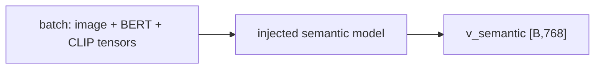

### 2.2 `ForensicTextEncoder` (`forensic_text.py`)

- **Constructor:** `ForensicTextEncoder(model, example_input=None)`
- **forward:** `forward(batch) -> Tensor` (cached features path).
- **forward_text:** `forward_text(text) -> Tensor` — delegates to the model's
  `runtime_forward` if present (raw-text inference); never used for probing so the
  heavy backbone is not triggered at construction.
- **Wraps (typical):** Qwen2-7B-Instruct (frozen) + `Linear(3584→768)`.

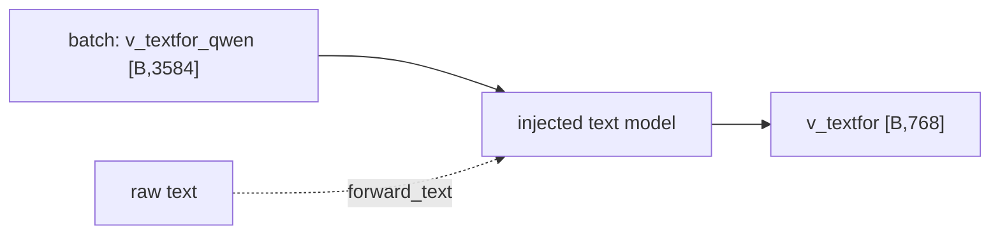

### 2.3 `ImageForensicEncoder` (`image_forensic.py`)

- **Constructor:** `ImageForensicEncoder(model, example_input=None)`
- **forward:** `forward(batch) -> Tensor[B, out_dim]`.
- **Wraps (typical):** DCT ResNet50 (1-channel conv), reads `v_imgfor_dct [B,1,224,224]`.

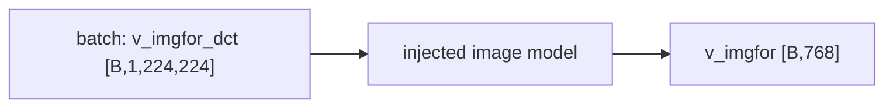

### 2.4 `FusionModule` (`fusion.py`)

- **Constructor:** `FusionModule(model, example_features=None, out_key="main_logits")`
- **forward:** `forward(features) -> dict` (e.g. `main_logits`, `aux_logits`, `fused`).
- **out_dim:** probe with a feature dict (batch ≥ 2 for `BatchNorm1d`), select the
  `out_key` tensor, read `shape[-1]`; else read `("out_dim","output_dim","num_classes")`.
- **Wraps (typical):** V3PairwiseFusion (3-pair cross-attention + Conv1d + MLP).

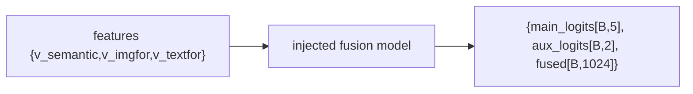

### 2.5 `MainPipeline` (`main_pipeline.py`)

- **Constructor:** `MainPipeline(semantic, image, text, fusion, feature_keys=…)`
- **Factory:** `from_models(semantic_model, image_model, text_model, fusion_builder, …)`
  — builds wrappers, reads encoder `out_dim`s, builds the fusion from them, probes it.
- **forward:** `forward(batch, text=None) -> dict`.
- **Helpers:** `out_dim` (delegates to fusion), `encoder_dims` (per-branch widths).

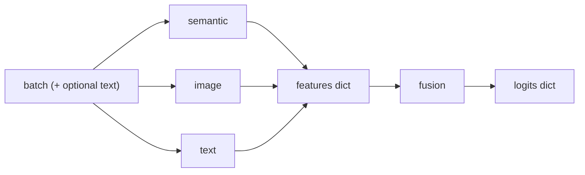

---

## 3. Data Flow (مسار البيانات)

### 3.1 End-to-end with shapes

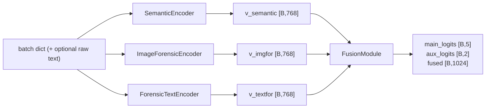

### 3.2 Merged-batch key routing

A single batch dict drives all three encoders; each injected model selects only
the keys it needs, so `MainPipeline` needs no routing logic.

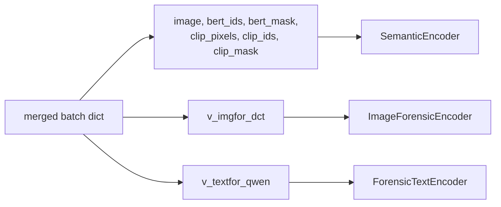

### 3.3 Fusion internals (inside the injected V3PairwiseFusion)

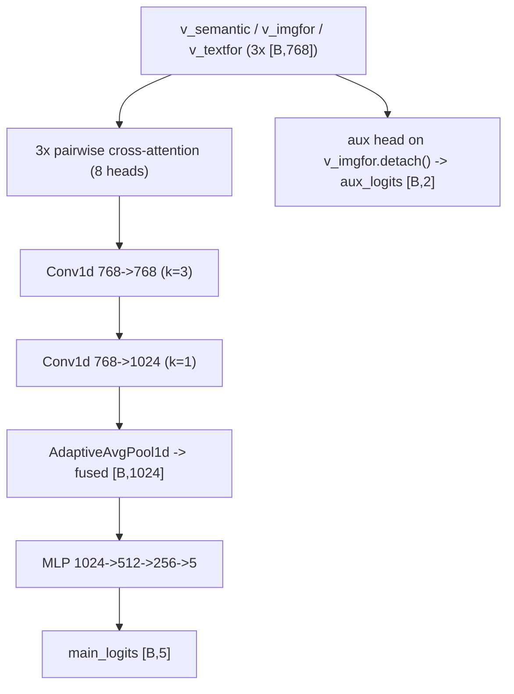

### 3.4 Shape table

| Stage | Input | Output |
|-------|-------|--------|
| `SemanticEncoder` | image + BERT/CLIP tensors | `v_semantic [B,768]` |
| `ForensicTextEncoder` | `v_textfor_qwen [B,3584]` or raw text | `v_textfor [B,768]` |
| `ImageForensicEncoder` | `v_imgfor_dct [B,1,224,224]` | `v_imgfor [B,768]` |
| `FusionModule` | 3 × `[B,768]` | `main_logits [B,5]`, `aux_logits [B,2]`, `fused [B,1024]` |

---

## 4. Control Flow (تسلسل التنفيذ)

### 4.1 Construction (`MainPipeline.from_models`)


### 4.2 Inference (`MainPipeline.forward`)

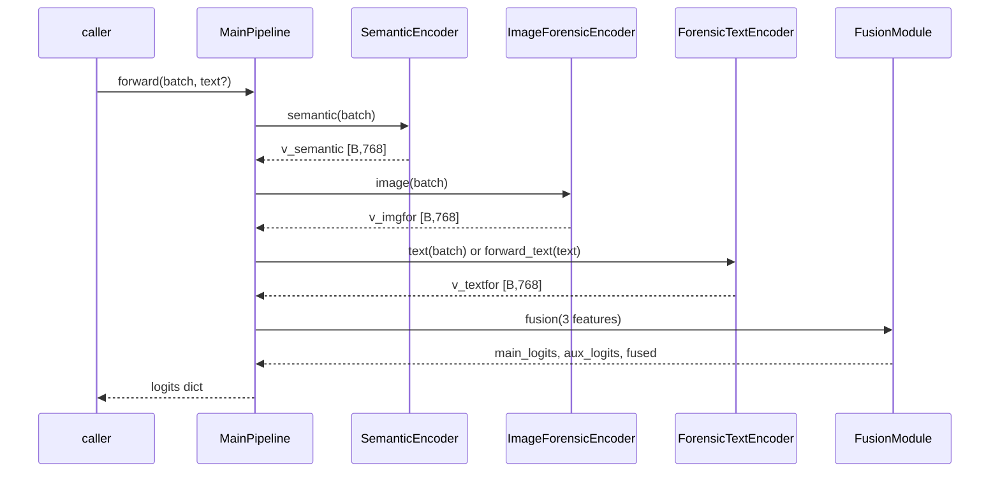

### 4.3 `out_dim` resolution (decision flow)

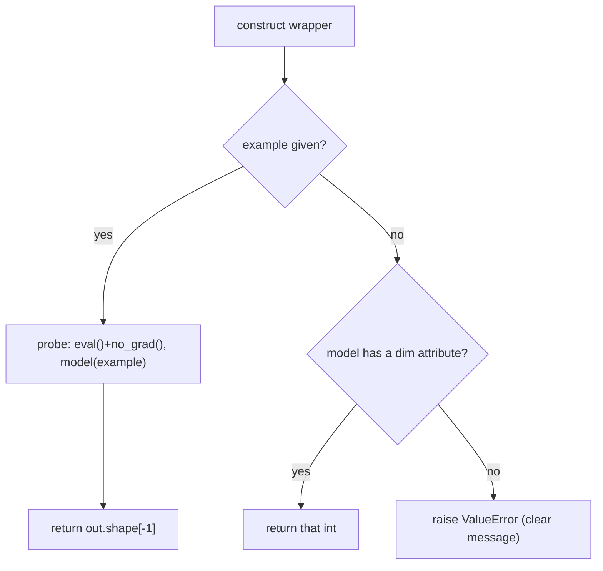

### 4.4 Probe lifecycle (no side effects)

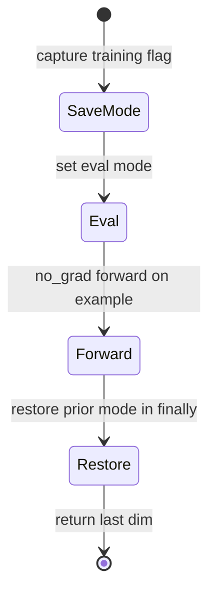

---

## 5. Component Integration (تكامل المكوّنات)

### 5.1 Integration map

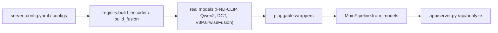

### 5.2 Contract each injected model must satisfy

| Wrapper | Model `forward` input | Model `forward` output |
|---------|----------------------|------------------------|
| `SemanticEncoder` | the batch object you pass | `Tensor [B, D]` |
| `ForensicTextEncoder` | the batch object you pass | `Tensor [B, D]` (+ optional `runtime_forward(text)`) |
| `ImageForensicEncoder` | the batch object you pass | `Tensor [B, D]` |
| `FusionModule` | feature dict | `Tensor` **or** dict containing a `Tensor` (default key `main_logits`) |

### 5.3 Server request flow (target integration)

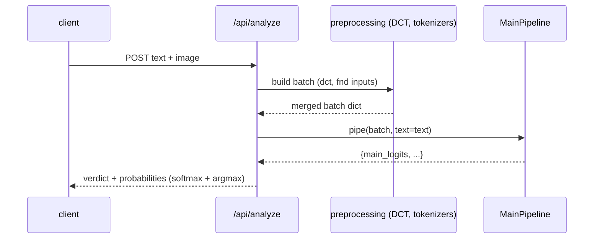

---

## 6. Extensibility Guide (دليل إضافة نموذج جديد)

### 6.1 Swap a model in an existing branch (one file)

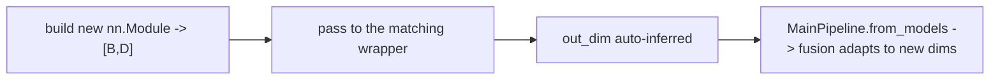

```python
my_image_model = MyNewImageNet(out_dim=1024)        # any nn.Module -> [B,1024]
img = ImageForensicEncoder(
    my_image_model,
    example_input={"v_imgfor_dct": torch.zeros(2, 1, 224, 224)},
)
assert img.out_dim == 1024
pipe = MainPipeline.from_models(
    semantic_model=..., image_model=my_image_model, text_model=...,
    fusion_builder=lambda ds, di, dt: build_fusion({"type": "v3_pairwise",
                                                    "feat_dim": ds, "num_classes": 5}),
    image_example={"v_imgfor_dct": torch.zeros(2, 1, 224, 224)},
)
```

### 6.2 Add a brand-new modality (a 4th branch)

This is the one case that touches more than one file (by design).

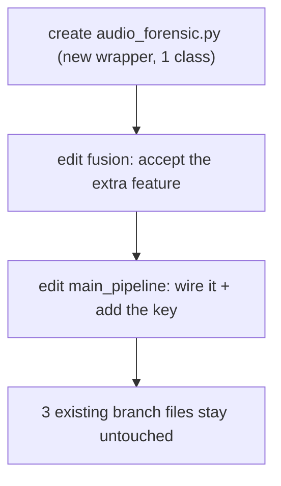

### 6.3 Rules for a new model

1. It must be an `nn.Module`.
2. Its `forward` must return `Tensor [B, D]` (fusion may return a dict).
3. Either expose a dimension attribute **or** pass an `example_input`.
4. For a runtime/raw path, implement `runtime_forward(text)` (text branch).

---

## 7. Evaluation Methodology (منهجية التقييم)

### 7.1 Evaluation pipeline

```mermaid
flowchart LR
    DS["test set (2,475, balanced)"] --> PIPE["MainPipeline(batch)"]
    PIPE --> LOG["main_logits [B,5]"]
    LOG --> ARG["argmax"]
    ARG --> MET["classification report + confusion matrix + F1-macro"]
```

### 7.2 Task, dataset, metrics

- **Labels:** `0 Real · 1 Out-of-Context · 2 Manipulated · 3 AI-Text · 4 Fully-Fabricated`.
- **Test set:** 2,475 held-out, **balanced** (495 / class).
- **Primary metric:** **F1-macro**; also accuracy, per-class P/R/F1, confusion matrix.
- **Deployment:** 3-seed ensemble (42 / 1337 / 2024, softmax-averaged) + temperature calibration.
- **Transfer:** MMFakeBench zero-shot with log-prior bias correction.

### 7.3 Ablation methodology (two complementary methods)

```mermaid
flowchart TB
    subgraph TRAIN["Training-time branch ablation"]
        T1["semantic only -> 0.6681"]
        T2["+ text -> 0.7103"]
        T3["+ image -> 0.6975"]
        T4["all three -> 0.7157"]
    end
    subgraph INF["Inference-time leave-one-out"]
        I1["full -> 0.7149"]
        I2["disable image -> -2.0 pp"]
        I3["disable text -> -26.6 pp"]
        I4["semantic only -> -40.0 pp"]
    end
```

### 7.4 Results

**Headline (deployed ensemble):** F1-macro **0.7149**, accuracy **0.7305**.

| Class | Precision | Recall | F1 | Support |
|-------|-----------|--------|-----|---------|
| Real | 0.428 | 0.370 | 0.397 | 495 |
| Out-of-Context | 0.447 | 0.438 | 0.442 | 495 |
| Manipulated | 0.707 | 0.814 | 0.757 | 495 |
| AI-Text | 0.984 | 0.994 | 0.989 | 495 |
| Fully-Fabricated | 0.994 | 0.986 | 0.990 | 495 |
| macro avg | 0.726 | 0.731 | 0.7149 | 2475 |


---

## 8. Verification status

All checks were run and pass:

- `python main_pipeline.py` → end-to-end demo with dummy models of **different**
  widths (768 / 512 / 256) → `out_dim` auto-inferred; `main_logits [4,5]`.
- Edge cases: attribute fallback; probe overrides a stale attribute;
  `BatchNorm1d` survives the probe (eval + batch 2); clear error when neither
  source is available.
- Decoupling: grep confirms the four branch files do not import each other; only
  `main_pipeline.py` / `__init__.py` import them.
- One class per branch file; no hardcoded model dimensions in the four wrappers.

---

## 9. Analysis & Notes (تحليلنا وملاحظاتنا)

### 9.1 Strengths
- **True dependency injection** — wrappers are model-agnostic and trivially testable.
- **No hardcoded dimensions** — widths flow from probe/attribute, so swapping a
  model can change dims without editing fusion/classifier by hand.
- **Decoupling is structural** — enforced by imports, verifiable with one grep.
- **Side-effect-free construction** — probe restores training mode; runs under `no_grad()`.

### 9.2 Deliberate trade-offs
- **Probe vs attribute ordering** — probe is truth, but we fall back to attributes
  so construction never forces a heavy backbone (e.g. Qwen2-7B) to run.
- **`BatchNorm1d` constraint** — probe forces `eval()` and batch ≥ 2.
- **`out_dim` logic duplicated across the four files** — to honour "exactly 5 files /
  no shared helper". Relaxing that constraint would allow a `_probe.py` leaf util.
- **Fusion has two widths** (`num_classes`, `fused_dim`); `out_dim` defaults to
  `main_logits`, switchable via `out_key`.

### 9.3 Limitations / risks
- **Shape assumption** — `out_dim = out.shape[-1]`; models returning `[B,T,D]` or
  tuples need an adapter.
- **"Edit one file" = swapping, not adding modalities** — a new branch necessarily
  touches `fusion` + `main_pipeline`.
- **Device ownership** — wrappers don't move the injected model to a device; the
  caller does (the probe only moves the example input).
- **Pass-through outputs** — `aux_logits` / `fused` are returned untouched.

### 9.4 Model-quality notes (separate from pipeline design)
- **Real ↔ OOC is at-chance** (F1 ≈ 0.40 / 0.44) — frozen FND-CLIP cross-modal ceiling.
- **Classes 3/4 near-perfect** (F1 ≈ 0.99) — Qwen text branch isolates AI text.
- **DCT image detector weak on MidJourney/VQDM** (AP ≈ 0.83).

### 9.5 Recommendations
1. Add the dummy-model checks as a committed `tests/` unit test.
2. Optionally support an `example_factory` (lazy callable) for device-aware probes.
3. Wire `MainPipeline` into `app/server.py` to retire the hand-written inference block.
4. Document the `[B, D]` output contract in each branch docstring (partly done).
