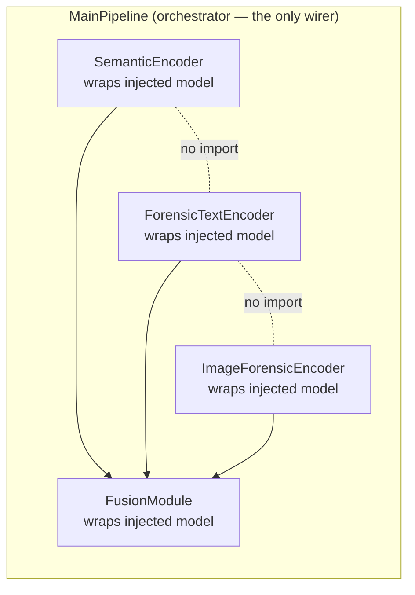
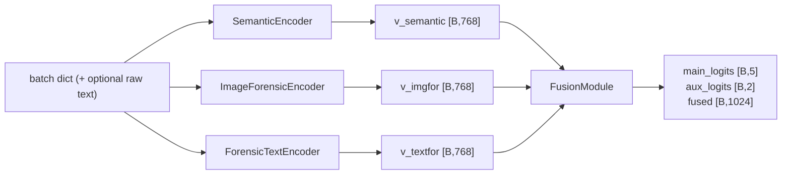
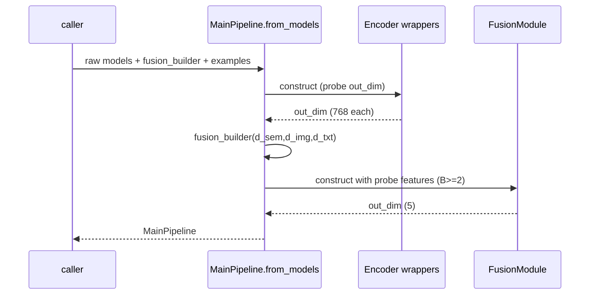

# MultiGuard Pluggable Pipeline — Technical Design Review

> Scope: the dependency-injection pipeline under `phases/v4/src/v4/pipeline/`
> (5 single-class files). This review covers Architecture, Data Flow, Control
> Flow, Component Integration, an Extensibility Guide, the Evaluation
> Methodology, and our analysis & notes.

---

## 0. Summary

The pipeline was refactored from a "build-it-inside" design into a **pluggable,
dependency-injection** design. Every model is **passed in from the outside**;
no wrapper builds a model. Each wrapper **auto-infers its `out_dim`** (no
hardcoded dimensions). The four branch files are **fully decoupled** (they never
import each other); only `main_pipeline.py` wires them together.

| Goal | How it is met |
|------|---------------|
| Pluggable / any model | Models injected via `__init__`; wrappers are model-agnostic |
| No hardcoded dimensions | `out_dim` inferred from a probe forward (or a model attribute) |
| Strict decoupling | Branch files import only `torch` + stdlib; never each other |
| Single orchestrator | Only `MainPipeline` imports the four wrappers |
| Swap a model = edit one file | Build a different model, pass it to the matching wrapper |

---

## 1. Architecture (المعمارية)

Five units, **one class per file**:

| File | Class | Responsibility |
|------|-------|----------------|
| `semantic.py` | `SemanticEncoder` | wrap the semantic model → `v_semantic` |
| `forensic_text.py` | `ForensicTextEncoder` | wrap the text-forensic model → `v_textfor` |
| `image_forensic.py` | `ImageForensicEncoder` | wrap the image-forensic model → `v_imgfor` |
| `fusion.py` | `FusionModule` | wrap the fusion model → logits dict |
| `main_pipeline.py` | `MainPipeline` | orchestrate the four; produce final output |

All wrappers subclass `torch.nn.Module`, so the pipeline is a normal PyTorch
module (works with `.to(device)`, `.eval()`, `state_dict`, autograd, etc.).



**Design principles**

- **Dependency injection** — the wrapper receives a ready `nn.Module`; it raises
  `TypeError` if you pass anything else. It never constructs a backbone.
- **Auto `out_dim`** — resolved at construction time, in priority order:
  1. **Probe forward** (source of truth): run the injected model once on a
     supplied `example_input` under `eval()` + `no_grad()` and read `out.shape[-1]`.
  2. **Attribute fallback**: read the first positive int among
     `("out_dim","output_dim","embed_dim","hidden_size")` for encoders, or
     `("out_dim","output_dim","num_classes")` for fusion.
  3. Otherwise raise a clear `ValueError`.
- **Strict decoupling** — enforced by import discipline (verified via grep:
  only `main_pipeline.py` and `__init__.py` import the wrappers).

---

## 2. Data Flow (مسار البيانات)

The three encoders consume one **merged batch dict** (each picks only the keys it
needs) and emit fixed-width vectors; the fusion consumes the three vectors and
emits a logits dict.

| Stage | Input | Output |
|-------|-------|--------|
| `SemanticEncoder` | `batch` (image + BERT/CLIP tensors) | `v_semantic [B, out_dim]` |
| `ForensicTextEncoder` | `batch` (text features) or raw `text` | `v_textfor [B, out_dim]` |
| `ImageForensicEncoder` | `batch` (`v_imgfor_dct`) | `v_imgfor [B, out_dim]` |
| `FusionModule` | `{v_semantic, v_imgfor, v_textfor}` | `{main_logits [B,5], aux_logits [B,2], fused [B,1024]}` |

With the real MultiGuard models, every encoder `out_dim = 768` and the fusion
`out_dim = 5` (number of classes).



**Key convention:** a single batch dict drives all three encoders because each
injected model selects its own keys (e.g. the image model reads `v_imgfor_dct`).
`MainPipeline` does no per-encoder input routing.

---

## 3. Control Flow (تسلسل التنفيذ)

There are two distinct phases: **construction** (dimensions resolved once) and
**inference** (per-batch forward).

### 3.1 Construction (`MainPipeline.from_models`)

1. Build the three encoder wrappers → each runs its `out_dim` inference.
2. Read `semantic.out_dim`, `image.out_dim`, `text.out_dim`.
3. Call `fusion_builder(d_sem, d_img, d_txt)` to build the fusion model **outside**
   using those widths (so fusion's input dims are not hardcoded either).
4. Build a probe feature dict (`torch.zeros(2, d)` per branch — batch ≥ 2 so
   `BatchNorm1d` survives) and construct `FusionModule`, which probes its `out_dim`.



### 3.2 Inference (`MainPipeline.forward`)

1. `v_semantic = semantic(batch)`
2. `v_imgfor = image(batch)`
3. `v_textfor = text.forward_text(text)` if raw `text` is given, else `text(batch)`
4. assemble `features = {k_sem: …, k_img: …, k_txt: …}`
5. `return fusion(features)` → `{main_logits, aux_logits, fused}`

The probe runs under `eval()`/`no_grad()` and **restores the model's prior
training mode** afterwards (`try/finally`), so construction has no side effects
on training state.

---

## 4. Component Integration (تكامل المكوّنات)

### 4.1 Contract each injected model must satisfy

| Wrapper | Model `forward` input | Model `forward` output |
|---------|----------------------|------------------------|
| `SemanticEncoder` | the batch object you pass | `Tensor [B, D]` |
| `ForensicTextEncoder` | the batch object you pass | `Tensor [B, D]` (+ optional `runtime_forward(text)`) |
| `ImageForensicEncoder` | the batch object you pass | `Tensor [B, D]` |
| `FusionModule` | feature dict | `Tensor` **or** dict containing a `Tensor` (default key `main_logits`) |

If the model already exposes a dimension attribute (`output_dim`, `num_classes`,
…), no `example_input` is needed — the wrapper reads it directly.

### 4.2 Integration with the real MultiGuard stack

The wrappers are drop-in over the existing registry-built encoders/fusion:

```python
from v4.core.registry import build_encoder, build_fusion, import_all
from v4.pipeline import MainPipeline

import_all()
semantic_model = build_encoder({"type": "fnd_clip", "feat_dim": 512, "output_dim": 768})
image_model    = build_encoder({"type": "univfd",   "out_dim": 768})
text_model     = build_encoder({"type": "qwen2_7b", "hidden_size": 3584, "output_dim": 768})

pipe = MainPipeline.from_models(
    semantic_model=semantic_model,
    image_model=image_model,
    text_model=text_model,
    fusion_builder=lambda ds, di, dt: build_fusion({"type": "v3_pairwise",
                                                    "feat_dim": ds, "num_classes": 5}),
)
# these encoders expose output_dim, so no example inputs are required
out = pipe(batch, text=raw_text)   # {'main_logits':[B,5], 'aux_logits':[B,2], 'fused':[B,1024]}
```

This mirrors the current `app/server.py` inference block
(`features = {...}; fusion(features)`), so the pipeline can replace it without
behaviour change.

---

## 5. Extensibility Guide — adding / swapping a model (دليل إضافة نموذج جديد)

### 5.1 Swap a model in an existing branch (the common case)

Edit **only** that branch's call site — build a different `nn.Module` and inject
it. Nothing else changes; the fusion adapts because its input width comes from
the encoder's `out_dim`.

```python
# Example: replace the image-forensic backbone with a new detector.
my_image_model = MyNewImageNet(out_dim=1024)        # any nn.Module -> [B,1024]
img = ImageForensicEncoder(
    my_image_model,
    example_input={"v_imgfor_dct": torch.zeros(2, 1, 224, 224)},  # if no out_dim attr
)
assert img.out_dim == 1024     # inferred automatically

# rebuild the pipeline; fusion is constructed from the new dims
pipe = MainPipeline.from_models(
    semantic_model=..., image_model=my_image_model, text_model=...,
    fusion_builder=lambda ds, di, dt: build_fusion({"type": "v3_pairwise",
                                                    "feat_dim": ds, "num_classes": 5}),
    image_example={"v_imgfor_dct": torch.zeros(2, 1, 224, 224)},
)
```

**Rules for a new model**
1. It must be an `nn.Module`.
2. Its `forward` must return `Tensor [B, D]` (fusion may return a dict).
3. Either expose a dimension attribute **or** pass an `example_input`.
4. If it needs a runtime/raw path, implement `runtime_forward(text)` (text branch).

### 5.2 Add a brand-new modality (a 4th branch)

This is the one case that touches more than one file (by design): create a new
single-class wrapper file (e.g. `audio_forensic.py`), and update **`fusion`**
(to accept the extra feature) and **`main_pipeline`** (to wire it and add the
key). The three existing branch files stay untouched. See §8 for why this is the
correct boundary of the "edit one file" guarantee.

---

## 6. Evaluation Methodology (منهجية التقييم)

The pipeline emits `main_logits [B,5]`, so evaluation is identical to the
existing V4 protocol.

- **Task / labels:** 5-class — `0 Real · 1 Out-of-Context · 2 Manipulated ·
  3 AI-Text · 4 Fully-Fabricated`.
- **Test set:** 2,475 held-out samples, **balanced** (495 per class).
- **Primary metric:** **F1-macro** (equal weight per class). Also report
  accuracy, per-class precision/recall/F1, and the confusion matrix.
- **Deployment setting:** 3-seed ensemble (seeds 42 / 1337 / 2024,
  softmax-averaged) + temperature calibration.
- **Ablation — two complementary methods:**
  - *Training-time branch ablation*: train with subsets of branches
    (semantic-only, +text, +image, all) to measure each branch's contribution.
  - *Inference-time leave-one-out*: zero a branch on the trained model to
    measure dependence.
- **External transfer:** MMFakeBench zero-shot, with a log-prior bias correction
  for class imbalance.

**Headline results (deployed ensemble):** F1-macro **0.7149**, accuracy
**0.7305**. Per-class F1: Real 0.397 · OOC 0.442 · Manipulated 0.757 ·
AI-Text 0.989 · Fully-Fabricated 0.990. (Full tables + confusion matrix in
`reports/Experimental_Setup_MultiGuard.*`.)

**How to evaluate the pluggable pipeline:** wrap the trained models with
`MainPipeline.from_models`, run the test loader through `pipe(batch)`, take
`argmax(main_logits)`, and feed predictions to the existing
`v4.evaluation` reporting (classification report + confusion matrix). Output is
bit-compatible with the current path.

---

## 7. Verification status

All checks were run and pass:

- `python main_pipeline.py` → end-to-end demo with dummy models of **different**
  widths (768 / 512 / 256) → `out_dim` auto-inferred, `main_logits [4,5]`.
- Edge cases: attribute fallback; probe overrides a stale attribute;
  `BatchNorm1d` survives the probe (eval + batch 2); clear error when neither
  source is available.
- Decoupling: grep confirms the four branch files do not import each other; only
  `main_pipeline.py` / `__init__.py` import them.
- One class per branch file; no hardcoded model dimensions in the four wrappers.

---

## 8. Analysis & Notes (تحليلنا وملاحظاتنا)

### 8.1 Strengths
- **True dependency injection** — wrappers are model-agnostic and trivially
  unit-testable with dummy modules.
- **No hardcoded dimensions** — `out_dim` flows from probe/attribute, so swapping
  a model can change widths without editing the fusion or classifier by hand.
- **Decoupling is structural, not conventional** — enforced by imports and
  verifiable with a one-line grep.
- **Side-effect-free construction** — probe restores training mode; runs under
  `no_grad()`.

### 8.2 Deliberate trade-offs
- **Probe vs. attribute ordering.** The probe is the source of truth, but we
  deliberately *fall back* to attributes so construction never forces a heavy
  backbone to run (e.g. Qwen2-7B). The text wrapper specifically avoids probing
  via `runtime_forward` (which would load ~15 GB) and only probes the cheap
  cached path.
- **`BatchNorm1d` constraint.** The classifier uses `BatchNorm1d`, which fails in
  train mode / batch 1. The probe therefore forces `eval()` and the factory uses
  batch ≥ 2. This is baked into `from_models`.
- **`out_dim` logic is duplicated across the four files.** To honour the "exactly
  5 files / no shared helper" constraint, the ~15-line probe is inlined in each
  wrapper instead of living in a 6th utility module. This trades a little DRY for
  strict decoupling; if that constraint is relaxed, a `_probe.py` leaf utility
  would remove the duplication without coupling the branches.
- **Fusion has two meaningful widths** (`num_classes` and `fused_dim`). We default
  `out_dim` to `main_logits` (classes) and expose `out_key` to switch to `fused`
  when a downstream stage needs the fused vector.

### 8.3 Limitations / risks
- **Shape assumption.** `out_dim` is `out.shape[-1]`; models returning
  `[B, T, D]` or tuples need an adapter (the wrappers expect `[B, D]`).
- **"Edit one file" is about swapping, not adding modalities.** Swapping a model
  within a branch is one-file. Adding a *new* branch necessarily touches `fusion`
  + `main_pipeline` (they must learn the new feature) — this is the right
  boundary, but worth stating explicitly.
- **Device ownership.** Wrappers don't move the injected model to a device; the
  caller does (the probe only moves the *example input* to the model's device).
- **Pass-through outputs.** `aux_logits` / `fused` are returned untouched; the
  pipeline does not interpret them.

### 8.4 Model-quality notes (separate from pipeline design)
These come from the *models*, not the wiring, and are unchanged by this refactor:
- **Real ↔ OOC is at-chance** (F1 ≈ 0.40 / 0.44) — the frozen FND-CLIP can't do
  the cross-modal alignment (linear-probe AUC ≈ 0.51). A data/encoder ceiling.
- **Classes 3/4 are near-perfect** (F1 ≈ 0.99) — the Qwen text branch isolates
  AI-written text cleanly; on arbitrary human-plausible AI text the margin
  shrinks.
- **DCT image detector is weak on MidJourney/VQDM** (AP ≈ 0.83).

### 8.5 Recommendations
1. Add the dummy-model checks as a committed `tests/` unit test.
2. Optionally support an `example_factory` (lazy callable) for device-aware probes.
3. Wire `MainPipeline` into `app/server.py` to retire the hand-written inference
   block (behaviour-preserving).
4. Document the `[B, D]` output contract in each branch's docstring (partially
   done) and consider a tuple/dict adapter for non-standard models.
