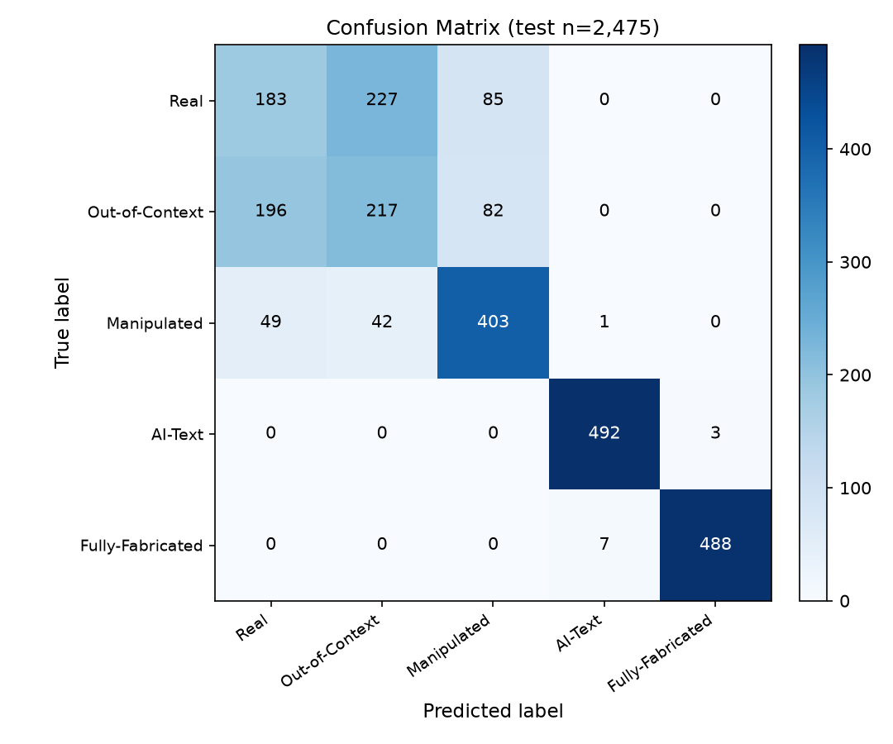

# Experimental Setup

## I. Experimental Setup

### A. Hardware Environment

- **GPU:** NVIDIA GeForce RTX 4070 (12 GB VRAM)
- **CPU:** Intel Core i5-13500 (14 cores / 20 threads)
- **RAM:** 32 GB
- **Storage:** ~155 GB (full datasets)

### B. Software Stack

- **Operating System:** Windows (CUDA 12.4+)
- **Programming Language:** Python 3.12
- **Core Libraries:** PyTorch + torchvision, Hugging Face Transformers, OpenCV / Pillow, scikit-learn, NumPy, pandas

### C. Model Hyperparameters

**Semantic — FND-CLIP**
- Backbone: ResNet50 + BERT + CLIP (Frozen)
- Embedding Dimension: 512 -> 768
- Learning Rate: 1e-4 (AdamW)
- Batch Size: 32
- Dropout Rate: -

**Image Forensic — DCT ResNet50**
- Backbone: ResNet50, 1-channel conv (fine-tuned)
- Embedding Dimension: 768
- Learning Rate: 1e-4 -> 1e-5 (AdamW)
- Batch Size: 64
- Dropout Rate: 0.3

**Text Forensic — Qwen2-7B-Instruct**
- Backbone: Qwen2-7B (Frozen) + Linear 3584->768
- Embedding Dimension: 3584 -> 768
- Learning Rate: 1e-4 (AdamW, projection)
- Batch Size: 64
- Dropout Rate: -

**Fusion — V3PairwiseFusion + MLP**
- Backbone: Pairwise cross-attention (8 heads) + Conv1d + MLP
- Embedding Dimension: 768 -> 1024 -> 5
- Learning Rate: 1e-4 (AdamW)
- Batch Size: 64
- Dropout Rate: 0.5 (MLP) / 0.1 (attention)

## II. Evaluation Results & Ablation Studies

### a. Ablation studies

| Variant | Accuracy | F1-macro |
| --- | --- | --- |
| Semantic only | - | 0.6681 |
| Semantic + Text | - | 0.7103 |
| Semantic + Image | - | 0.6975 |
| All three (full) | 0.7305 | 0.7149 |

### b. Classification report

| Class | Precision | Recall | F1 | Support |
| --- | --- | --- | --- | --- |
| Real | 0.428 | 0.370 | 0.397 | 495 |
| Out-of-Context | 0.447 | 0.438 | 0.442 | 495 |
| Manipulated | 0.707 | 0.814 | 0.757 | 495 |
| AI-Text | 0.984 | 0.994 | 0.989 | 495 |
| Fully-Fabricated | 0.994 | 0.986 | 0.990 | 495 |
| accuracy |  |  | 0.7305 | 2475 |
| macro avg | 0.726 | 0.731 | 0.7149 | 2475 |

### Confusion matrix

| true \ pred | Real | OOC | Manip | AI-Text | Fab |
| --- | --- | --- | --- | --- | --- |
| Real | 183 | 227 | 85 | 0 | 0 |
| Out-of-Context | 196 | 217 | 82 | 0 | 0 |
| Manipulated | 49 | 42 | 403 | 1 | 0 |
| AI-Text | 0 | 0 | 0 | 492 | 3 |
| Fully-Fabricated | 0 | 0 | 0 | 7 | 488 |

